# 2025年你必须了解的15款顶级AI加密货币交易机器人

盯盘盯到眼睛发酸，却还是错过了最佳入场时机？加密货币市场24小时不停转，人肉交易根本跟不上节奏。AI交易机器人正在改变游戏规则——它们不睡觉、不情绪化、不会因为恐慌抛售或贪婪追高。从零配置的傻瓜式操作到支持自定义策略的专业级工具，这15款交易机器人覆盖了从新手到资深玩家的所有需求。无论你是想躺赚的佛系持币者，还是追求高频套利的量化爱好者，这份榜单都能帮你找到最适合自己交易风格的自动化方案。

***

## **[DipSway](https://dipsway.com)**

零配置AI自动驾驶模式，新手三分钟启动量化交易。

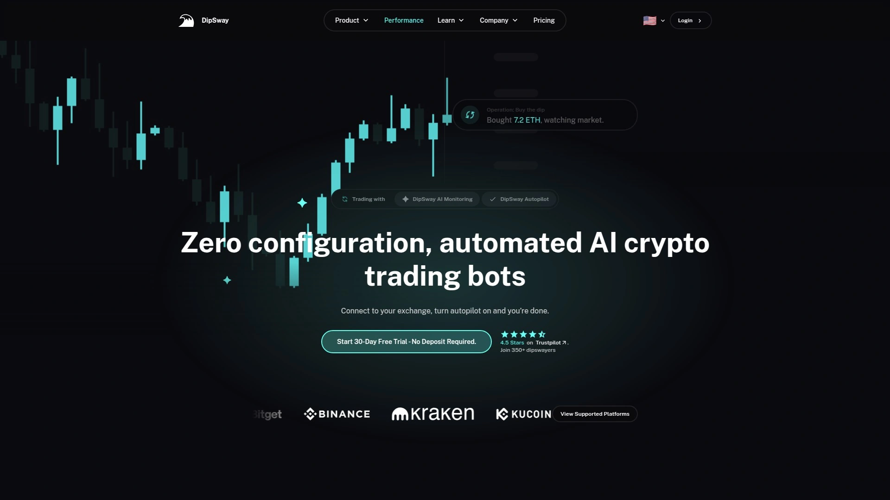

DipSway最大的特点就是"真·开箱即用"——连接交易所、打开自动驾驶，就这么简单。平台使用121+个技术指标和17+个模式检测器来预判市场走势，这套组合拳让机器人能在拉盘前进场、在暴跌前出货。

**自动驾驶的智能程度：**
DipSway的Autopilot模式不只是自动执行交易，它还会根据市场状况自动选择最值得交易的币种。你不需要研究K线、不需要设置参数，机器人会替你做所有决策。这对于白天要上班、晚上要睡觉的普通人来说简直是福音。

支持5+个主流交易所，可以同时交易315+个加密货币。平台提供30天模拟交易模式，让你先用虚拟资金测试效果，零风险熟悉系统运作逻辑。

**用户真实反馈：**
有用户报告月均回报率4-5%，部分单笔交易利润达到9-10%。TrustPilot上的评价普遍称赞其"说到做到"的靠谱属性。客服响应速度快，每个用户都会分配专属客服经理，监控你的交易表现并在必要时提供优化建议。

**安全设计：**
你的资金始终留在交易所账户，DipSway只需要最基本的交易执行权限。平台还设置了IP白名单机制——即使你的API密钥泄露，黑客也无法用它执行交易。

适合那些想要尝试量化交易、但又不想花时间研究复杂策略的忙碌人士。AI神经网络每天自动学习和适应市场变化，让你的机器人越跑越聪明。

***

## **[Cryptohopper](https://www.cryptohopper.com)**

全球75万用户验证，社交交易市场让你一键复制高手策略。

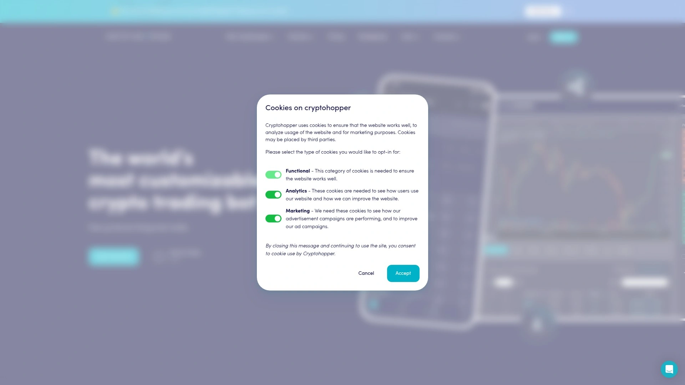

Cryptohopper是云端交易机器人领域的老牌玩家，最吸引人的是它的社交交易生态。平台内置策略市场，你可以直接购买经验丰富的交易员设计好的策略包，或者订阅第三方分析师的交易信号。

支持17个主流交易所，提供网格交易、DCA（定投）、做空等多种策略模板。回测功能让你用历史数据验证策略效果，避免盲目上线亏钱。

**分层服务体系：**
- 免费计划：适合测试和小额交易
- 进阶计划（$29-$107.5/月）：解锁更多机器人数量和高级功能

移动端APP体验流畅，随时随地调整机器人参数。社区活跃度高，新手可以在论坛找到大量教程和策略讨论。

平台的追踪止损功能特别实用——跟随价格上涨自动调高止损线，锁定利润的同时给币价继续上涨留出空间。对于想要学习别人成功经验、快速上手自动化交易的新手来说，Cryptohopper的策略市场是最大亮点。

***

## **[3Commas](https://3commas.io)**

专业交易员首选，DCA机器人和智能交易终端组合拳。

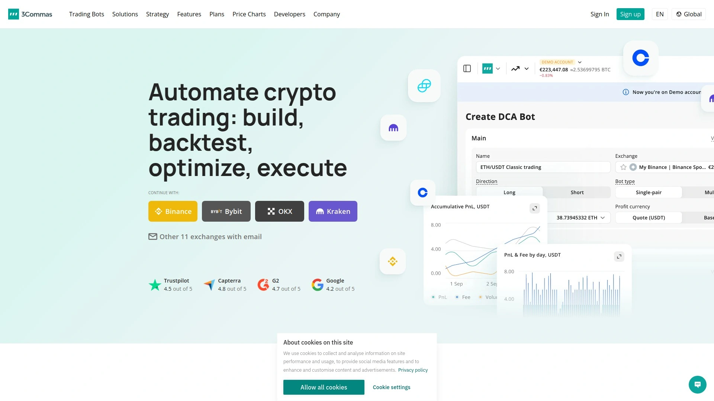

3Commas在专业交易圈子里口碑很硬，它的DCA（平均成本）机器人是招牌功能。这款机器人可以监控100+个交易对，自动找到符合你条件的最佳入场机会。当币价下跌时，机器人会按照预设策略加仓，拉低持仓成本，等反弹时一次性获利了结。

**机器人矩阵：**
- **DCA机器人**：最灵活可配置，适合各种市场环境
- **信号机器人**：整合TradingView信号，甚至支持同时做多做空
- **网格机器人**：横盘市场的收割机，通过密集的买卖单赚取小幅波动利润
- **智能交易**：精细化控制每笔订单，配置追踪止盈、追踪止损、多重获利点

支持18个交易所，回测功能基于1分钟级别的历史数据，最长可回溯一年。这种精细度让你能真实评估策略在不同市场阶段的表现。

定价透明：从每月$4到$59不等，免费版提供1-2个机器人供新手体验。用户评价显示，掌握机器人机制后，年化收益15-30%是可实现的目标（低风险无杠杆情况下）。

平台不断迭代新功能，最近更新的回测系统新增8项实用特性。安全方面，3Commas无法访问你的资金，只能执行开仓平仓操作。

***

## **[Pionex](https://www.pionex.us)**

16款免费内置机器人，交易所和机器人二合一。

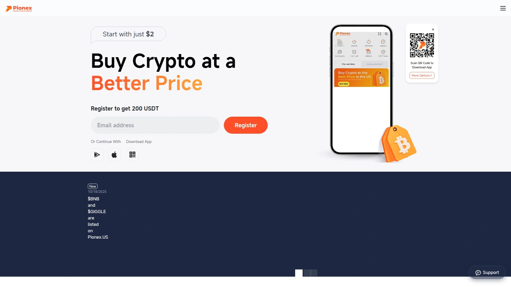

Pionex最颠覆的点在于它本身就是一个交易所，同时免费提供16款专业级交易机器人。没有订阅费、没有隐藏收费，所有机器人功能都是标配。

**明星机器人阵容：**
网格交易机器人是人气王，在你设定的价格区间内密集布置买卖单，币价每波动一次就自动低买高卖一轮。Pionex还提供AI策略建议——系统分析近期数据后自动推荐网格参数，不懂技术分析也能科学设置。

DCA机器人适合定投党，无限网格机器人适合长期看涨的币种，套利机器人捕捉不同市场的价差机会。杠杆网格机器人支持做多、做空、中性三种模式，让你在期货市场也能自动化收割波动。

**一键切换交易模式：**
现货手动交易、现货机器人、合约机器人之间无缝切换，不需要跳转平台。界面设计简洁，移动端体验甚至比很多专业机器人平台还流畅。

社区内有大量用户分享网格机器人的长期收益数据，证明这套自动低买高卖的逻辑在加密货币的高波动环境下确实有效。对于不想支付机器人订阅费、又想享受完整自动化交易功能的用户，Pionex是零成本最优解。

***

## **[Coinrule](https://coinrule.com)**

250+条预设规则，用"如果-那么"逻辑搭建交易策略。

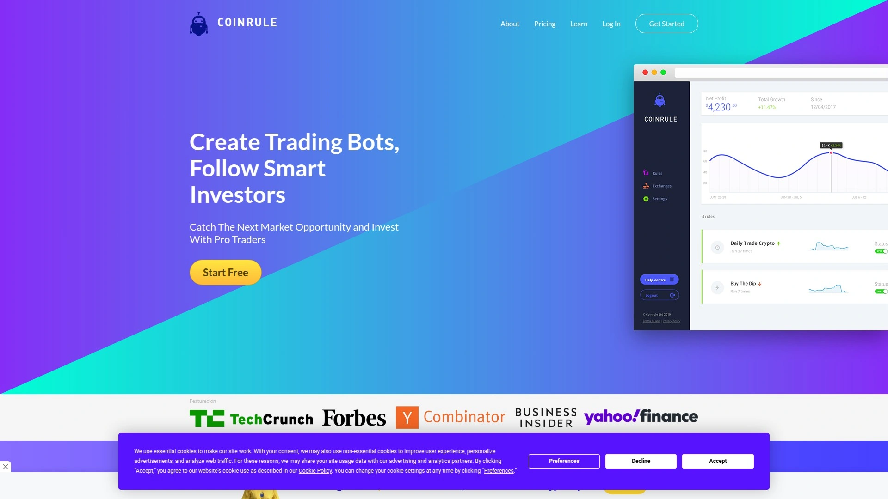

Coinrule把复杂的交易策略拆解成简单的IFTTT（如果这样-那么那样）逻辑。比如："如果BTC跌破30000美元，那么买入0.1 BTC"或者"如果我的ETH盈利15%，那么卖出50%仓位"。这种人话表达的方式让完全不懂编程的人也能设计出专业级策略。

支持10个主流交易所（包括Binance、Coinbase、KuCoin等），还支持去中心化交易所Uniswap。平台提供250+条可自定义规则，涵盖止损、做多、再平衡、基于价格的定投等几乎所有常见策略。

**技术指标整合：**
可以组合使用布林带、RSI、MACD等技术指标作为触发条件。多个信号可以串联使用，构建出手动操作很难精确执行的复杂策略。

定价从免费版到$449.99/月，新手可以先用免费版测试规则逻辑。回测功能让你看到策略在历史行情中的表现，上线前心里有底。

教育资源丰富，有详细的新手教程用通俗语言解释每个功能。每周市场更新邮件帮你跟踪行情变化。界面设计对初学者友好，规则页面的逻辑搭建过程像玩拼图一样直观。

适合想要自己掌控策略细节、又不想学编程的中级玩家。一旦规则设定好，机器人24/7自动监控市场并执行你的交易逻辑。

***

## **[Bitsgap](https://www.bitsgap.com)**

50万用户的选择，COMBO机器人最高10倍杠杆期货交易。

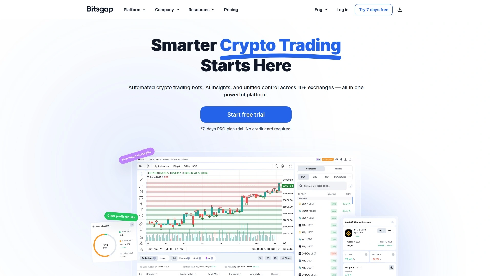

Bitsgap是综合性交易平台，集成了机器人交易、投资组合管理和交易终端。支持15+个交易所，让你在一个界面管理多个交易所账户。

**COMBO交易机器人**是平台最受欢迎的功能，专为加密货币期货设计。它结合了网格交易和DCA策略的优点，支持最高10倍杠杆，还配备了止损、止盈、追踪下单等风控工具。回测功能让你在上线前验证策略可行性。

智能订单系统帮你设置复杂的条件单，交易服务器响应速度快，在波动剧烈的行情下也能快速成交。

**用户体验：**
界面友好，新手也能快速上手机器人的创建和管理。客服响应速度快，平台内置的沟通门户让问题解决流程高效顺畅。

模拟交易功能让你用虚拟资金测试策略，不冒真金白银风险就能积累经验。报警和执行系统运行稳定，用户反馈很少出现漏单或延迟问题。

定价模式曾遭到一些批评，但平台的功能全面性和用户友好的界面仍然获得高度评价。适合想要在一个平台同时管理现货和期货自动化交易的中高级交易者。

***

## **[TradeSanta](https://tradesanta.com)**

2018年上线的云端老炮，预设模板让新手秒变策略家。

TradeSanta是专注于自动化交易的云端平台，主打快速设置和免维护运行。10分钟内就能完成从注册、连接交易所到启动机器人的全流程。

**策略模板库：**
平台提供预填充的机器人模板，新手可以直接使用做多或做空模板，避免被海量参数选项搞晕。当然，专业玩家也能从零开始自定义配置。

支持网格、DCA和期货交易策略，智能订单执行包括止损、止盈、追踪功能。布林带、RSI、MACD等技术指标可以作为入场信号，多个过滤器可以同时使用提高精准度。

**风险管理：**
同时运行做多和做空机器人可以对冲风险。Bitcoin图表分析工具提供波动率、动态等关键信息，帮你把握市场状态。

支持Binance、OKX、Kraken、Bybit等8个主流交易所。无交易量限制，不收取额外手续费（只有交易所本身的费率）。

回测和模拟交易功能让你先验证后实战。移动APP支持随时随地管理机器人，监控交易进度。社区活跃，文档完善，新手友好度高。

免费版提供基础功能，付费版解锁更多高级特性。适合想要快速启动自动化交易、不愿意花太多时间研究复杂设置的各级交易者。

***

## **[Mizar](https://mizar.com)**

按业绩收费的良心模式，赚钱才付费。

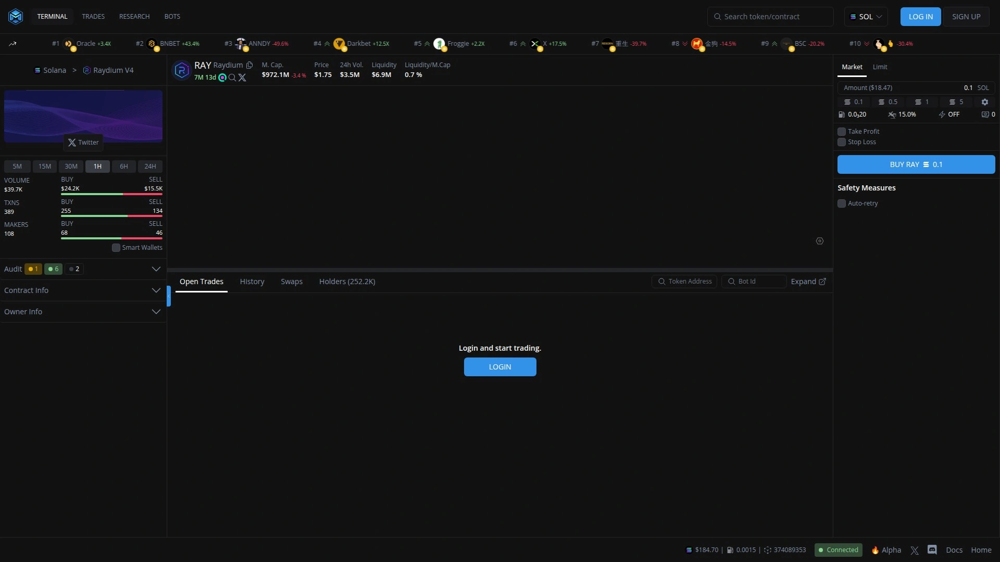

Mizar最特别的地方是它的收费模式——不收订阅费，只在你盈利时收取0.0047%-0.1%的业绩分成。这种模式把平台和用户的利益绑定在一起，平台赚钱的前提是你先赚到钱。

**社交交易生态：**
Mizar的复制交易市场让你可以直接跟单成功交易员的策略。平台整合11个主流交易所，支持多交易所并行操作。

机器人类型包括DCA（定投）、网格交易、高频刷单、AI智能交易和追踪止损机器人。AI智能交易机器人使用机器学习根据市场状况动态调整参数，在波动剧烈的市场环境下优化盈利能力。

**智能订单执行：**
风险管理工具包括动态止损调整、多重止盈点设置等。云端运行，不需要安装软件，浏览器就能完成所有操作。

刷单机器人专为短线交易和高频策略设计，适合日内交易者。网格机器人在横盘市场表现出色，通过预设价格区间的买卖单捕捉小幅波动。

对于不想预付高额订阅费、希望先看到效果再付费的用户，Mizar的业绩收费模式降低了尝试门槛。适合想要测试多种策略、或者通过复制交易快速入门的各级玩家。

***

## **[HaasOnline](https://www.haasonline.com)**

极客最爱的私有化部署方案，HaasScript让你编写任意复杂策略。

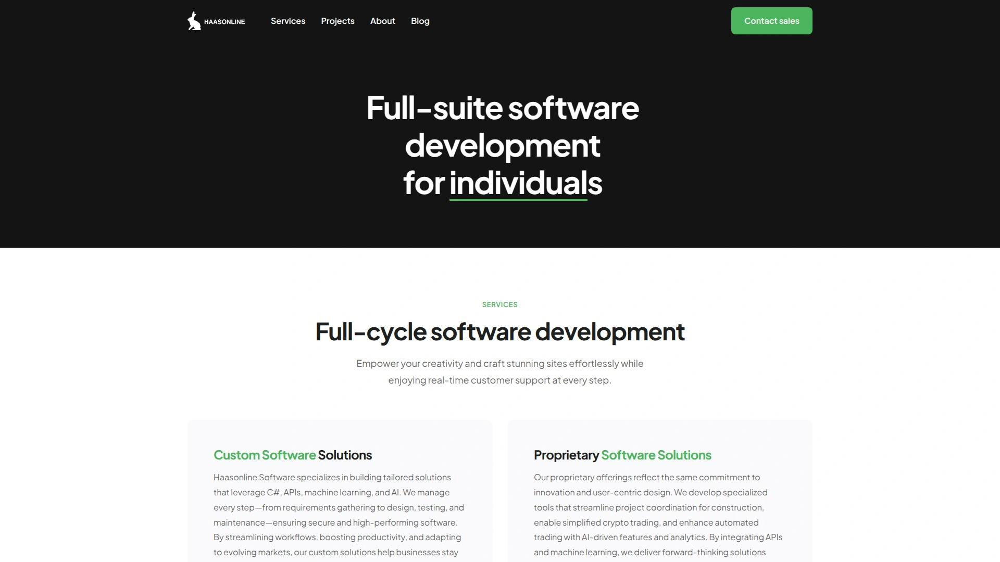

HaasOnline是为高级用户设计的专业级交易机器人平台。它最大的特色是HaasScript脚本语言——一种专为加密货币交易设计的编程语言，支持面向对象编程、订单模板和可视化拖拽编辑器。

支持23个交易所，覆盖现货和衍生品市场。套利框架和高级回测功能是其强项，特别适合基于价格对的套利策略。

**自定义深度：**
如果你会写JavaScript，HaasOnline提供的灵活性几乎没有边界。可以直接访问价格数据流、订单函数和数学库，浏览器端开发者几分钟就能上手。

TradingView和任何支持webhook的信号源都可以通过简单的POST请求整合进来。预设策略覆盖所有验证过的类别：现货和期货网格、DCA、基于指标的交叉策略、流动性提供报价、刷单微周期和多步追踪。

**部署方式：**
可以部署在本地电脑或私有服务器上，API密钥不需要上传到第三方服务器，安全性高。定价从每月$9到$99不等。

学习曲线比一般机器人陡峭，但对于想要完全掌控策略细节、或者需要实现非标准交易逻辑的专业玩家来说，HaasOnline提供的编程自由度是无价的。适合有编程背景或愿意投入时间学习的量化交易爱好者。

***

## **[Gunbot](https://www.gunbot.com)**

50万用户，终身授权买断制，本地运行保障API密钥安全。

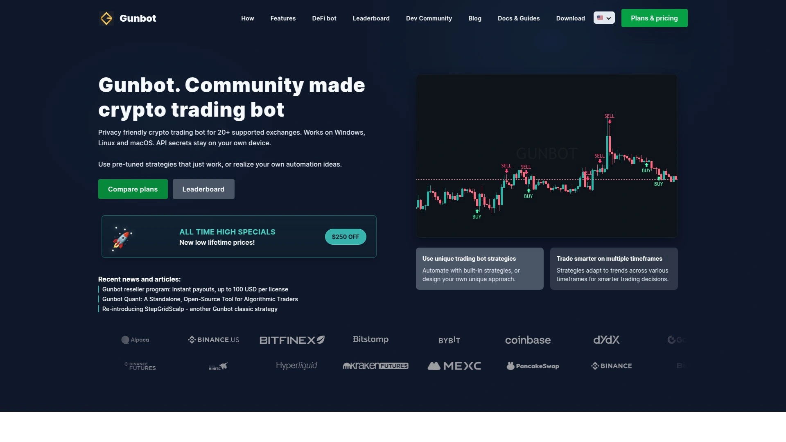

Gunbot采用独特的一次性付费模式——终身授权从$59起，后续所有更新免费。这种买断制让长期使用成本远低于按月订阅的平台。

**本地化部署优势：**
Gunbot直接运行在你的电脑或VPS服务器上，API密钥和私钥始终留在你的设备，永远不会上传到第三方服务器。这种自托管模式对于注重安全和隐私的交易者来说是最大卖点。

支持25+个交易所连接器，涵盖主流CEX和DeFi永续合约（包括dYdX v4、PancakeSwap等）。期货连接器支持USD-M、COIN-M和反向合约。

**策略类型：**
20+种买卖方法，包括现货和期货网格、DCA、基于指标的策略、流动性提供、刷单和追踪。完整的JavaScript引擎让你可以自定义任意复杂的交易逻辑，直接访问价格数据和订单函数。

预调优的策略模板降低新手入门难度，同时保留了高级用户所需的完全定制能力。TradingView警报和外部信号通过webhook轻松整合。

**社区驱动开发：**
几乎所有功能都是根据社区反馈开发的，更新频率高。活跃的社区提供交易和技术支持。

运行在你自己的设备上意味着数据安全完全由你掌控，没有第三方依赖。适合重视数据隐私、希望长期使用且不想持续付费的中高级交易者。

***

## **[Altrady](https://www.altrady.com)**

跨19个交易所的多账户管理中枢，专业交易终端级体验。

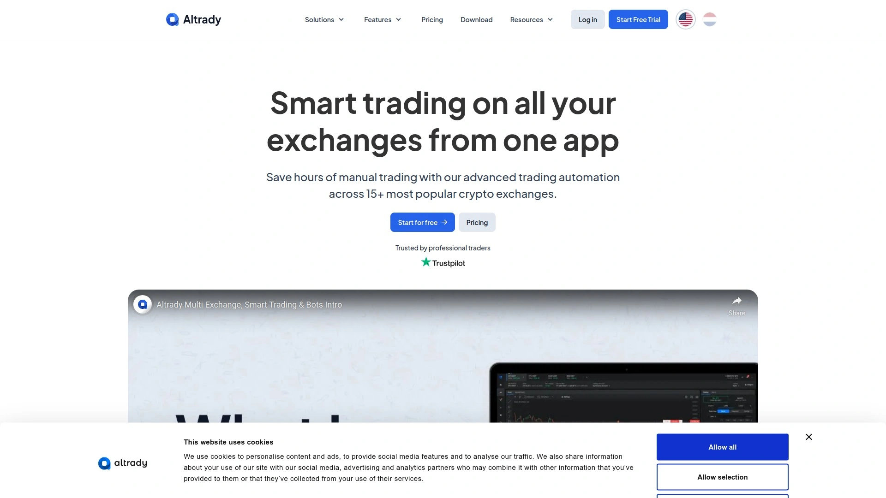

Altrady定位于多交易所整合平台，让你在一个界面管理分散在19个交易所的所有账户和资产。这种中央化管理对于在多个平台分散资金的交易者来说是刚需。

**核心功能矩阵：**
- 多入口订单系统：一次性设置多个价位的分批入场单
- 智能订单：复杂的条件单和组合订单
- 交易终端：快速手动交易界面，支持限价单和市价单
- 机器人交易：可定制的自动化策略

快速交易服务器确保订单执行延迟最小，在剧烈波动行情下也能及时成交。模拟交易功能让你用虚拟资金测试策略和熟悉平台操作。

**投资组合工具：**
实时监控所有交易所的资产分布、盈亏情况和交易历史。统一的图表分析工具支持多种技术指标和绘图工具。

定价从免费版到每月$89，免费版已经包含基本的多交易所管理功能。平台持续更新，博客文章提供交易策略和平台使用技巧。

适合同时在多个交易所操作、需要统一管理界面的中高级交易者。无论是手动交易还是机器人自动化，Altrady都能提供专业级的工具支持。

***

## **[Stoic AI](https://stoic.ai)**

机构级量化策略下放给散户，AI策略自动匹配风险偏好。

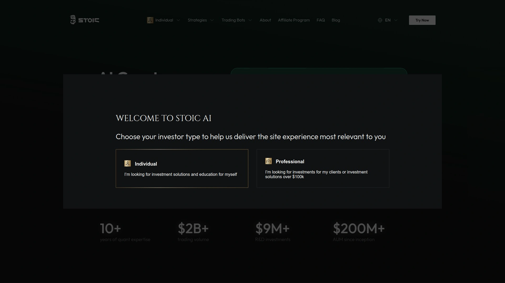

Stoic AI由专业量化团队开发，将机构级的量化交易策略包装成普通投资者也能使用的自动化服务。平台使用AI分析市场数据并代表你执行交易，全程无需人工干预。

**策略选择机制：**
根据你的风险偏好和投资目标，Stoic AI提供多种AI驱动的交易策略供选择。一旦设置完成，机器人自动分析市场并执行交易，你只需要通过APP实时监控投资组合表现。

支持Binance、Coinbase、KuCoin、Crypto.com、Bybit等主流交易所。API连接仅用于执行交易，平台无法提取你账户中的资金，安全性有保障。

**机构级量化思维：**
Stoic AI强调的是长期稳健增长而非高风险投机。策略设计基于专业量化团队的研究，普通投资者可以享受到原本只有机构才能获得的策略质量。

用户可以根据市场变化和自己的投资表现随时调整策略。界面简洁，操作流程对新手友好——三步完成设置：连接交易所、选择策略、启动机器人。

适合想要"躺赚"、不愿意花时间盯盘或研究策略，但又希望比简单持币更积极的投资者。专业团队的量化策略背书是其核心竞争力。

***

## **[Cornix](https://cornix.io)**

信号执行专家，把Telegram/Discord交易信号自动转化为真实订单。

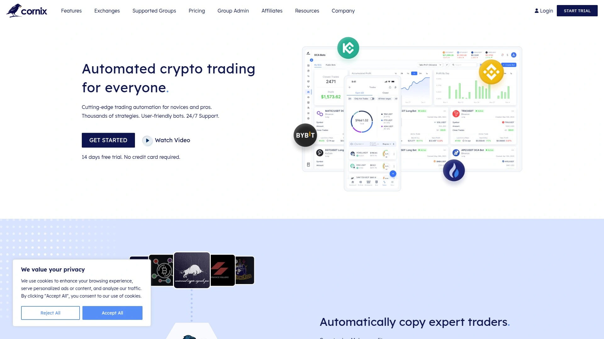

Cornix的定位很独特——它不生产交易信号，而是帮你自动执行来自Telegram、Discord等渠道的交易信号。如果你订阅了某个交易员的信号频道，Cornix可以自动读取信号并在你的交易所账户执行相应操作。

**信号解析能力：**
支持多种信号格式，自动识别入场价、止损价、多个止盈目标等信息。你可以设置资金管理规则，比如每个信号使用账户资金的百分比，或者基于账户余额的固定金额。

风险管理功能包括追踪止损、部分获利、加仓逻辑等。可以同时管理现货和期货交易，支持多个交易所并行运行。

**无需编程：**
整个设置过程通过机器人配置界面完成，不需要写代码。支持回测和模拟模式，让你先验证信号源质量再投入真金。

14天免费试用，无需信用卡。后续订阅费根据功能层级不同而变化。24/7客服支持确保遇到问题能快速解决。

适合订阅了高质量交易信号、但不想手动执行每个信号的交易者。Cornix把信号转化为实际交易的自动化流程，让你不错过任何机会，同时保持严格的风险控制。

***

## **[TokenSets](https://www.tokensets.com)**

DeFi原生资产管理机器人，完全免费支持多链代币。

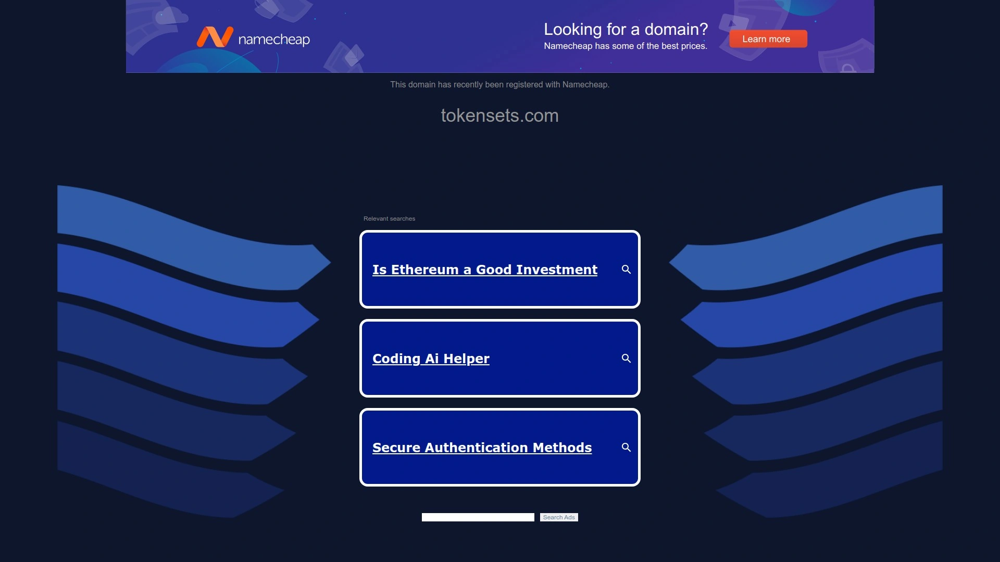

TokenSets是DeFi领域的自动化资产管理解决方案，完全运行在链上。它不是传统的交易机器人，而是让你创建或订阅"Sets"——一种自动再平衡的代币组合。

**链上自动化：**
支持Ethereum、Polygon和Optimism上的多种代币。整合Aave和Compound等DeFi协议，让你的资产不只是交易，还能自动参与借贷挖矿。

平台提供预设的Sets供新手直接订阅，经验丰富的DeFi玩家可以用任何ERC-20代币创建自定义Sets，设计自己的再平衡策略。

**费用结构：**
平台本身免费使用，仅收取0.10%的管理费（从Set内交易中扣除）。相比传统交易机器人的月费或业绩分成，成本极低。

TokenSets的再平衡机制类似于传统金融的指数基金——根据预设规则自动调整资产配置比例，保持投资组合与目标策略一致。

适合DeFi爱好者、想要自动化管理链上资产、或者希望通过组合投资分散风险的用户。完全去中心化的特性意味着没有中心化平台跑路风险，你的资产始终在链上智能合约中可见。

***

## **[CryptoRobotics](https://cryptorobotics.ai)**

现货和期货双栖，智能算法内置风险管理。

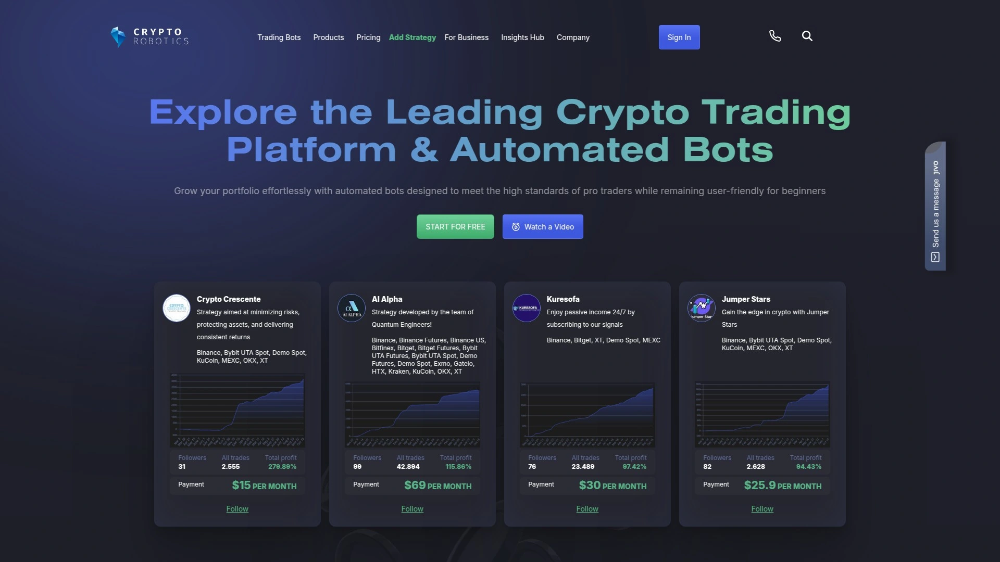

CryptoRobotics提供针对现货和期货市场优化的交易机器人，平台强调智能算法和内置风险管理系统。无论你是保守的现货交易者还是激进的期货玩家，都能找到合适的自动化方案。

**双模式支持：**
模拟交易模式让你在零风险环境测试策略，积累信心后再切换到真实交易。实盘交易直接连接你的交易所账户，机器人按照配置的策略24/7运行。

智能算法自动识别市场趋势和关键支撑阻力位，优化入场和出场时机。风险管理模块自动计算仓位大小、设置止损位，避免单次交易过度亏损。

**多策略并行：**
可以同时运行多个机器人，每个机器人执行不同的策略或交易不同的币种。这种组合方式分散风险，避免把所有筹码压在一个策略上。

界面设计现代化，操作逻辑清晰。客服团队提供及时支持，帮助用户解决从连接交易所到策略优化的各种问题。

适合想要同时管理现货和期货自动化交易、需要平台提供一定智能决策支持的中级交易者。内置的风险管理功能让你即使在睡觉时也能放心让机器人运行。

***

## **[Hummingbot](https://hummingbot.io)**

开源专业级做市商工具，支持19个DEX和24个CEX。

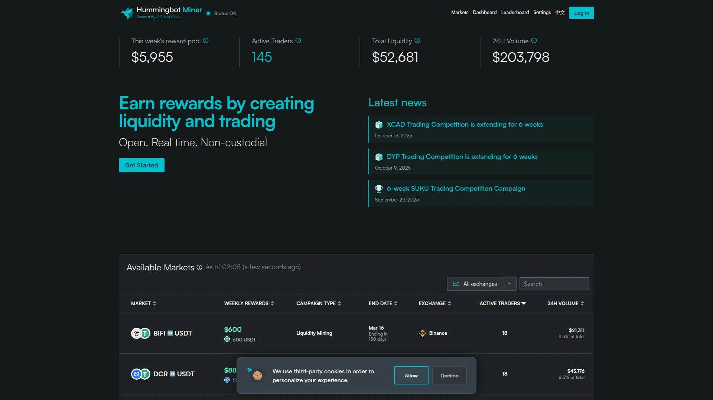

Hummingbot是完全开源的交易机器人软件，专为专业流动性提供者和做市商设计。它不是为散户"躺赚"准备的，而是给想要深度参与市场流动性提供、赚取做市商利润的专业玩家。

**做市策略引擎：**
提供多种做市策略模板，可以在订单簿上持续报价，从买卖价差中获利。支持跨交易所套利、流动性挖矿等高级策略。

支持19个去中心化交易所和24个中心化交易所，覆盖范围极广。完全开源意味着你可以审计代码、自定义修改、甚至贡献代码回社区。

**技术门槛：**
Hummingbot需要一定的技术背景才能充分利用。安装和配置过程相比图形化界面的机器人平台复杂，但换来的是无与伦比的灵活性和控制力。

文档详尽，社区活跃，技术问题可以在GitHub和Discord找到答案。对于想要成为专业做市商、或者需要高度定制化策略的量化团队，Hummingbot的开源特性和专业功能是最佳选择。

免费使用，没有订阅费或隐藏成本。适合有编程能力、想要深度参与DeFi和CEX流动性提供的专业交易者或小型量化团队。

***

## 常见问题

**加密货币交易机器人真的能赚钱吗？**
机器人本身不是印钞机，它们的盈利能力完全取决于你配置的策略和市场环境。在波动剧烈的横盘市场，网格交易机器人通过频繁低买高卖可以稳定获利；在单边趋势市场，追踪策略或DCA机器人效果更好。关键是理解每种策略的适用场景，并根据市场变化调整机器人配置。用户报告的月收益率从2-5%到15%以上不等，但这些数字都基于特定市场条件和策略设置。回测和模拟交易是降低风险的必经步骤——先用历史数据和虚拟资金验证策略可行性，再投入真金白银。机器人最大的价值在于消除情绪化决策、24/7不间断执行策略、以及精确执行复杂的条件单逻辑。

**新手应该选择哪种类型的交易机器人？**
新手首选零配置或预设模板丰富的平台。DipSway的自动驾驶模式让你完全不需要设置参数，机器人自动选币和交易。Coinrule的IFTTT逻辑用人话描述交易规则，不需要懂技术就能搭建策略。Pionex的16款免费机器人提供预设参数，直接启动就能运行。TradeSanta的模板库让你一键应用经验丰富交易员设计好的策略。刚开始建议从简单的网格交易或DCA（定投）策略入手——网格机器人在横盘市场自动低买高卖，逻辑直观易懂；DCA机器人帮你在下跌时分批建仓拉低成本，适合长期看好某个币的投资者。务必先用模拟交易模式熟悉平台操作和机器人逻辑，至少运行1-2周观察效果。初期投入小额资金测试，确认理解机器人运作方式后再逐步加仓。

**交易机器人的安全性如何保障？**
正规的交易机器人平台都采用API密钥连接方式，你的资金始终留在交易所账户，机器人只有交易权限没有提现权限。在创建API密钥时，务必关闭提现权限（withdraw），只授予交易（trade）和查询（read）权限。有些平台如DipSway还提供IP白名单功能——即使API密钥泄露，非白名单IP也无法使用。Gunbot这类本地运行的机器人安全性更高，API密钥从不上传到第三方服务器，完全存储在你自己的设备上。选择平台时注意查看用户评价、运营时长和安全认证，避免使用无名小平台。启用交易所的双重认证（2FA），定期检查API密钥权限设置，留意账户异常登录提醒。大多数安全问题源于用户自己的API密钥管理不当，只要遵循基本安全原则，机器人交易的风险是可控的。

***

## 开启24小时不打烊的自动化交易

从AI自动驾驶的极简体验到专业级的策略编程平台，这15款交易机器人覆盖了从零基础新手到量化专家的所有需求层级。加密货币市场从不休息，手动交易让你永远处于追赶状态，而自动化机器人能在你睡觉时帮你捕捉机会、在市场暴跌前帮你止损。对于想要快速启动、零配置就能开始量化交易的朋友，[DipSway](https://dipsway.com)的自动驾驶模式让AI替你做所有决策——从选币到交易执行全程托管，30天模拟交易期让你零风险体验机器人的实际表现。记住，最好的机器人不是收益率最高的那个，而是最适合你的交易风格、风险承受能力和时间投入度的那个。
